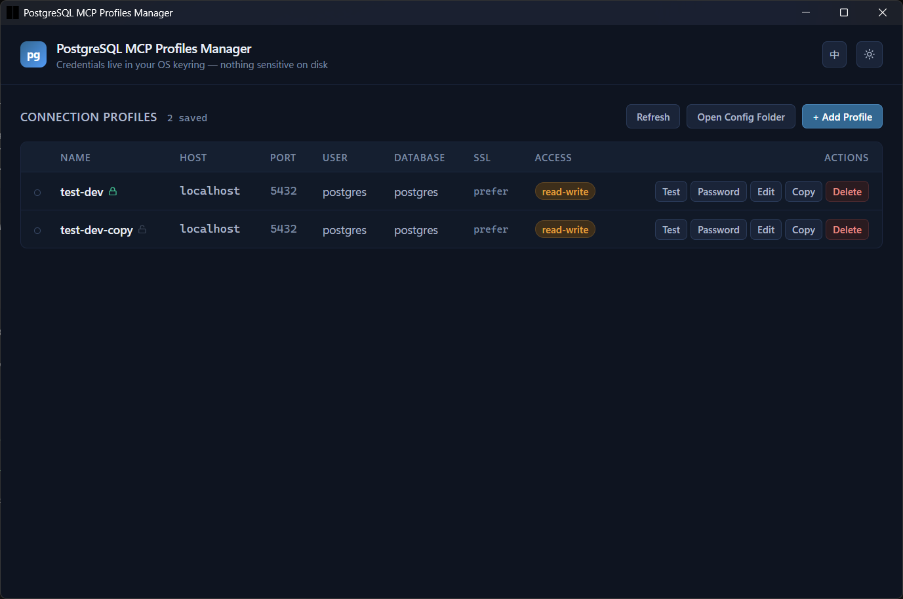
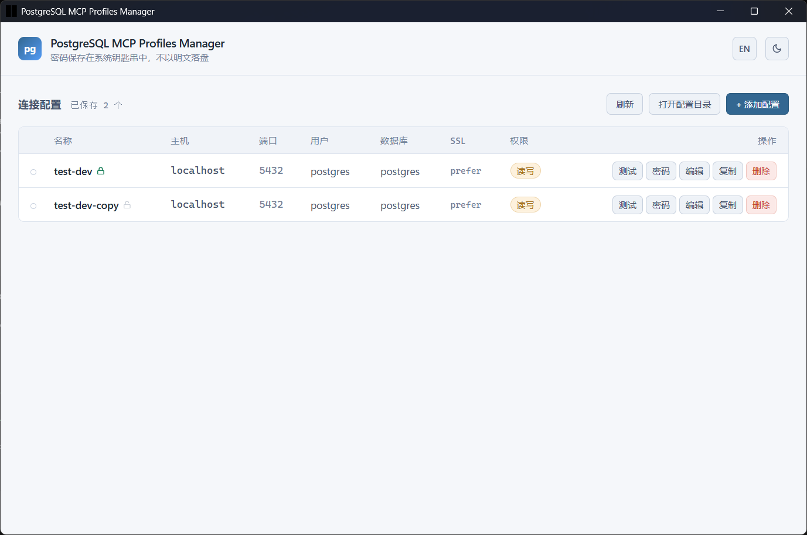

# PostgreSQL MCP Profiles Manager

A desktop GUI for managing [postgres-mcp](https://github.com/microsoft/postgres-mcp) connection profiles.

`postgres-mcp` stores connection profiles in `~/.postgres-mcp/connections.yaml` and passwords in your OS keyring. This app gives you a visual way to manage those profiles — no more hand-editing YAML or running `connection set-password` from a terminal.




## Features

- **CRUD profiles** — add, edit, copy, delete connection profiles
- **Password management** — set/view password status per profile; passwords go to the OS keyring (service name `postgres-mcp`, same as the CLI), never written to disk
- **One-click connection test** — verify connectivity and auth before saving
- **postgres-mcp compatible** — reads and writes the same `~/.postgres-mcp/connections.yaml` format; unknown fields like `is_azure` are preserved on save
- **Refresh** — reload after manually editing the YAML file
- **Dark / light theme** — toggle in the header, persisted
- **中文 / English** — language toggle in the header, persisted
- **Status indicators** — per-profile connection test result (green/red pip) and password-set lock icon

## Install

Download the installer from [Releases](https://github.com/hxbb00/postgres-mcp-profiles-manager/releases) (MSI or NSIS), or build from source:

```bash
# prerequisites: Node.js 22+, Rust toolchain
npm install
npm run tauri build
```

The installer and standalone exe are produced under `src-tauri/target/release/bundle/`.

## Usage

Launch the app. It reads profiles from `~/.postgres-mcp/connections.yaml` — if you already use `postgres-mcp`, your existing profiles show up automatically.

| Action | How |
|--------|-----|
| Add a profile | Click **+ Add Profile**, fill in the form, optionally set a password |
| Test a connection | Click **Test** on any row |
| Set a password | Click **Password** on any row (stored in OS keyring, shared with postgres-mcp CLI) |
| Edit / Copy / Delete | Per-row action buttons |
| Open config folder | Click **Open Config Folder** to inspect `~/.postgres-mcp/` directly |
| Reload after manual edits | Click **Refresh** |

### Access modes

- **read-only** (`ro`) — the profile is intended for read-only access
- **read-write** (`rw`) — the profile permits writes

The badge in the Access column shows the mode at a glance (green = ro, amber = rw).

## How it works

```
~/.postgres-mcp/connections.yaml     <- profile metadata (host, port, user, database, ssl_mode, access_mode)
Windows Credential Manager           <- passwords, under service name "postgres-mcp"
```

The app never stores passwords in the YAML file or anywhere on disk in plaintext. When testing a connection, the password is read from the keyring at connect time (or entered ad-hoc in the test dialog).

## Tech stack

- [Tauri 2](https://tauri.app) — Rust backend + WebView frontend
- React 19 + TypeScript + Tailwind CSS 3
- `keyring` crate — Windows Credential Manager
- `tokio-postgres` — async connection testing
- `serde_yaml` — postgres-mcp-compatible profile serialization

## Development

```bash
npm install
npm run tauri dev        # dev mode with hot reload

# tests
cd src-tauri && cargo test --lib
```

## License

[MIT](LICENSE)
